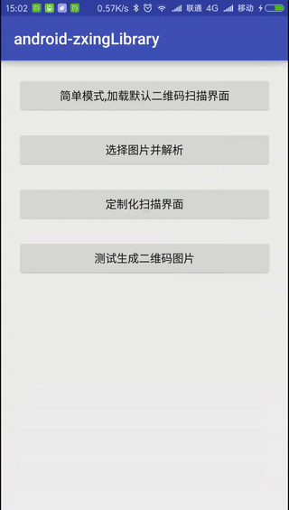
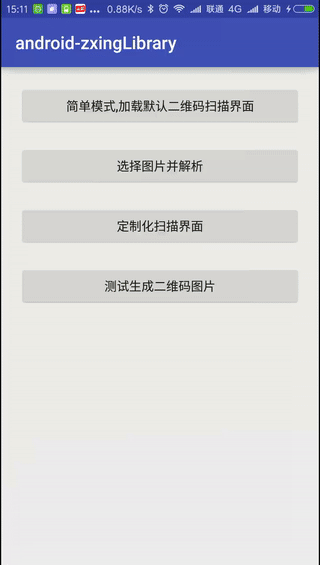
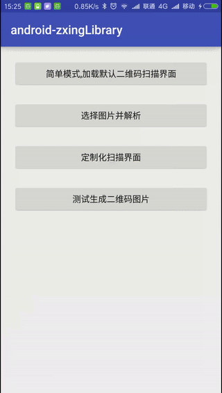

# Zxing-QrScan

QrScan Library, Support QrScan, Create QrScan, Using Zxing Library（二维码扫描库，支持二维码扫描和生成二维码，使用了Zxing库来支持二维码扫描）

## 预览

|       二维码扫描       |    自定义二维码扫描    |       生成二维码       |
| :--------------------: | :--------------------: | :--------------------: |
|  |  |  |

## ScanView属性说明

| 属性             | 值类型    | 默认值                               | 说明                     |
| :--------------- | :-------- | :----------------------------------- | :----------------------- |
| maskColor        | color     | #60000000 | 扫描区外遮罩的颜色       |
| frameColor       | color     | #7F1FB3E2 | 扫描区边框的颜色         |
| cornerColor      | color     | #FF1FB3E2 | 扫描区边角的颜色         |
| laserColor       | color     | #FF1FB3E2 | 扫描区激光线的颜色       |
| resultPointColor | color     | #C0EFBD21 | 扫描区结果点的颜色       |
| text             | string    |                                      | 扫描提示文本信息         |
| textColor        | color     | #FFC0C0C0 | 提示文本字体颜色         |
| textSize         | dimension | 14sp                                 | 提示文本字体大小         |
| textPadding      | dimension | 24dp                                 | 提示文本距离扫描区的间距 |
| textLocation     | enum      | top                                  | 提示文本信息显示的位置   |

## 导入

**`compile 'com.ayvytr:qrscan:2.1.0'`**

## Change Log

2.2.0
解决了解析**QrUtils.decodeBitmap**二维码图片解析不出的问题

2.1.0
解决了*CameraView*异常问题

2.0.0
1. 优化了**CameraView**的生命周期
2. 优化删除了多余的Handler Callback

## 使用

### 二维码扫描

使用CaptureFragment或者CaptureActivity即可，在onActivityResult接收返回结果，RESULT_OK时，将成功返回二维码，通过`QrUtils.RESULT`获取二维码字符串。

### 解析二维码

QrUtils.decodeBitmap

### 生成二维码Bitmap

QrUtils.createBitmap

